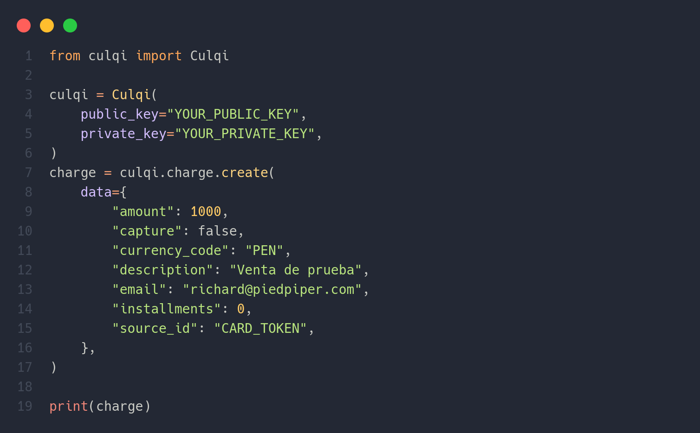

[](https://www.travis-ci.org/softbutterfly/culqi-api-python)
[](https://www.codacy.com/gh/softbutterfly/culqi-api-python/dashboard?utm_source=github.com&amp;utm_medium=referral&amp;utm_content=softbutterfly/culqi-api-python&amp;utm_campaign=Badge_Grade)
[](https://www.codacy.com/gh/softbutterfly/culqi-api-python/dashboard?utm_source=github.com&utm_medium=referral&utm_content=softbutterfly/culqi-api-python&utm_campaign=Badge_Coverage)
[](https://codecov.io/gh/softbutterfly/culqi-api-python)
[](https://requires.io/github/softbutterfly/culqi-api-python/requirements/?branch=master)

# Culqi API Python

Biblioteca de CULQI para el lenguaje Python, pagos simples en tu sitio web.

## Requisitos

- Python 3.6, 3.7, 3.8, 3.9
- Credenciales de comercio en [Culqi](https://culqi.com).

## Instalación

```bash
pip install culqi-api-python
```



Cada metodo retona un diccionario con la estructura

```python
{
      "status": status_code,
      "data": data
}
```

El `status_code` es el estatus HTTP numérico devuelto por la solicitud HTTP que se
realiza al API de Culqi, y `data` contiene el cuerpo de la respuesta obtenida.

## Documentación

- [Referencia de API](https://www.culqi.com/api/)
- [Ejemplos](https://github.com/softbutterfly/culqi-api-python/wiki)
- [Wiki](https://github.com/softbutterfly/culqi-api-python/wiki)

## Changelog

Todos los cambios en las versiones de esta biblioteca están listados en
[CHANGELOG.md](CHANGELOG.md).

## Desarrollo

[Revisa nuestra guia de contribución](CONTRIBUTING.md)

## Contribuidores
